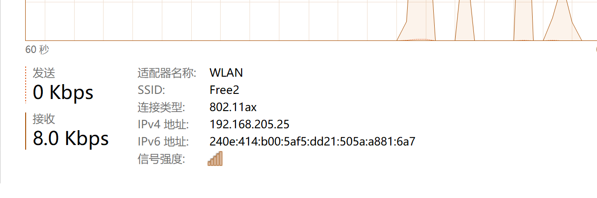
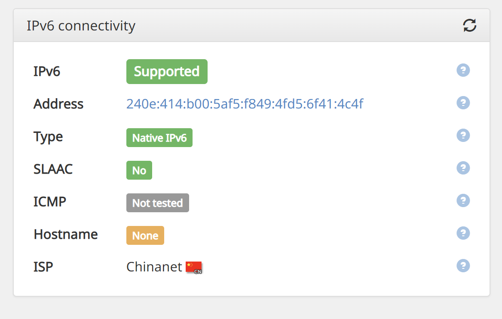

# 目录
- [目录](#目录)
  - [1分钟快速获取 IPv6 地址](#1分钟快速获取-ipv6-地址)
  - [IPv6 网络如何运行](#ipv6-网络如何运行)
  - [IPv6 地址是怎么分配的](#ipv6-地址是怎么分配的)
  - [IPv6 的应用场景](#ipv6-的应用场景)
  - [总结](#总结)
  - [下一篇](#下一篇)
  
## 1分钟快速获取 IPv6 地址
尽管 IPv6 目前在中国已经大面积铺开应用，不过家用有线宽带部署情况不是很乐观，具体原因下一章节解释。  

出人意料的，移动蜂窝网络已经基本完成了 IPv6 的部署，因此目前最简单，最快速的获取 IPv6 地址的方式，就是用您的手机开个热点。  

当您的电脑连上手机的热点后，您可以在任务管理器（win10以上系统）看到分配到了 IPv6 地址。  



在这张图中，笔者的 IPv6 地址是： `240e:414:b00:5af5:dd21:505a:a881:6a7`

请同学们根据上节课的内容，分析一下这个 IPv6 地址。
其站点前缀是 `240e:414:b00`，子网 ID 是 `5af5`。在后面的则是接口地址 `dd21:505a:a881:6a7`。

是不是很令人意外，IPv6 就在身边。

## IPv6 网络如何运行
上个章节讲到，家用有线宽带的部署情况不是很乐观，这里有一个比较通俗易懂的解释。

如果把网络之间互相连接电路比作高速公路，那么 IPv4 数据包和 IPv6 数据包则分别是小型箱车与大型卡车。

在互联网建设早期，由于只有 IPv4 数据包传输，因此为了支持其数据包的传输，各个网络节点都建设了支持小型箱车的装卸平台（协议支持），这些网络节点可能是路由器，也可能是您的电脑。

但是，IPv6 大卡车来了之后，尽管它可以上路，但是在某些网络节点由于缺乏装卸平台（协议支持），它无法抵达下一个网络节点。

因此，如果要使整个网络都能完整支持 IPv6，情况则变得复杂许多。最大的阻碍在于老旧设备无法通过软件升级去支持 IPv6，只能更换，耗资巨大。家庭网络除了要更换连接各个家庭的汇集设备，还要挨个更新支持 IPv6 协议的猫。如果用户家里还有单独的路由器，则要求这些路由器支持 IPv6。

阻力重重。

在现阶段，最好的办法仍然是 IPv4 网络和 IPv6 网络同时运行，以实现最大兼容。因此运营商目前的策略是旧的线路不管，新线路则支持 IPv6。

## IPv6 地址是怎么分配的
思绪回到刚刚到手的 IPv6 地址，现在可以玩了。
赶紧到 ipv6-test.com 测试一下网络能不能用。



嗯。看样子是没问题。

这里重点讲一下 ```SLAAC``` 这个标签。
在 IPv6 时代，IPv6 地址的分配方式主要是两种：

* 有状态分配。即传统的分配方案，与 IPv4 时代的路由器内网地址类似，这是由路由器生成一个地址给设备，有时间限制。甚至可以理解为动态 IP 地址。
  
* 无状态分配，通常就是指 ```SLAAC```。```SLAAC``` 是一种很简单好用的配置方式：由于在 IPv6 地址中，前缀和子网都是确定好的，如果路由器支持无状态分配，。通常情况下的分配方式是，系统会使用设备的 MAC 地址（物理地址）来作为其 IPv6 接口的一部分。

## IPv6 的应用场景 
看样子一切都准备就绪，可以起飞了。  
更快的 BT 速度，更好的联机体验！  
  
然而。  
  
在稍早前的章节说到，为了保持最佳兼容性，目前现阶段的互联网 IPv6 和 IPv4 这两个网络是同时运行，并且互相连接。因此并不是说有了 IPv6 就万事无忧了。  

举个例子：玩 P2P 游戏，虽然您已经连接到了 IPv6 网络，但是如果您的队友在 IPv4 网络，尽管您们通过 IPv4-IPv6 间的桥接转换能勉强互联，但是就又回到了有 NAT 的时代。IPv6 等于没用。  
  
究其原因，首先，在各个系统上运行的应用程序，很多早期开发完成的应用程序并不支持 IPv6，直接的结果就是无法在 IPv6 网络下工作。此外，由于网络架构发生了改变，要支持到 IPv6 ，甚至是需要额外开发专门的模块来支持，比如 Linux 上的防火墙，是单独的一个 ip6tables 在负责管理。似乎一切都变得复杂了很多。  
  
因此就实用性而言，目前 IPv6 的实用性还没办法与 IPv4 对等。作为普通用户，我们期待的是能完全取代 IPv4，不去做任何额外的工作。  
希望能等到那天的到来。  

## 总结
同时接入 IPv4 和 IPv6 的感觉就像家里拉了电信联通，以为是双倍的带宽，双倍的快乐。  
结果，只有一条线路能干活。这种感觉您有过吗。😂。

至此，面向普通用户的 IPv6 实用性知识点已经讲完了。  
  
我们会继续补充这个文档（扩展），但是作为一个实用性指南，它不会包含专业性的术语。  
也欢迎您提交 issues 和 PR，一起丰富这个文档。   
感谢阅读。 

## 下一篇
* [子网](SUBNET.md)

AD：[万能的网络连接优化服务，由微林提供](https://www.vx.link/?rel=github)
