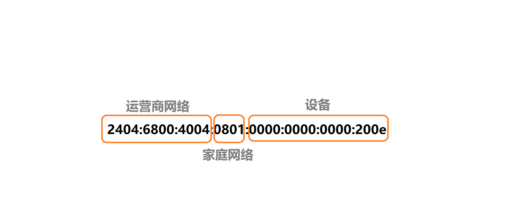

# IPv6 简明指南

## 目录
- [IPv6 简明指南](#ipv6-简明指南)
  - [目录](#目录)
  - [概览](#概览)
  - [IPv6 带来了什么](#ipv6-带来了什么)
  - [IPv6 地址的结构](#ipv6-地址的结构)
  - [前缀](#前缀)
  - [子网](#子网)
  - [接口](#接口)
  - [总结](#总结)
  - [接下来](#接下来)


## 概览
本文档主要讲解 IPv6 的一些皮毛知识，对家用来说，已经足够了。阅读本文档大约耗时 10 分钟。

本节内容：理解 IPv6 地址的一些概念，诸如前缀，子网，接口。

如果您具备一定关于 IPv4 的网络知识，那么相信您阅读本文档将能更快理解 IPv6。

## IPv6 带来了什么
如果把 IPv6 和 IPv4 做个类比，那您可以这样理解：IPv4 就相当于功能机时代，而 IPv6 就相当于进入了智能手机的时代。  

在功能机时代，大家相互联系一般靠手机号码，而智能手机的时代，二维码大行其道，我们有非常多的办法保持相互的联系，不再依赖手机号码。

IPv6 大抵如此，您一定听说过，IPv6 的地址空间足够给地球上的每粒沙子都分配一个 IPv6 地址。这正是它对于普通用户的最大意义。

## IPv6 地址的结构
IPv6 地址的完整结构是这样的：

```
0000:0000:0000:0000:0000:0000:0000:0000
```

它是一个 128 位（bit）长度的数据。在书写时，由 8 段 16 进制组成的数字加上一个冒号组成。

第一次接触 IPv6 地址会有一点奇怪，因为 IPv4 地址是 32 位（bit）的数据，以每 8 位加一个点隔离开，因此它通常是以 10 进制来表示，比如 `1.2.4.8` 。但是 IPv6 地址是 16 进制的，所以如果以 10 进制来表示会非常长，没有人会那么做。``没关系，很快就会习惯``。

看着如此长的 IPv6 地址，确实有理由相信 IPv6 可以给每一粒沙子分配一个地址。不过，这么长的 IPv6 地址，在实际传输时，可能会占用更多的带宽。为了解决这个问题，IPv6 地址的结构可以被缩短。

让我们来看看 Youtube 的 IPv6 地址：

```
2404:6800:4004:801::200e
```

这个 Youtube 的 IPv6 地址明显比开头的更短！因为这个地址已经被缩短了，如果要把它扩展为完整的 IPv6 地址，那么应该是这样：

```
2404:6800:4004:0801:0000:0000:0000:200e
```

一个 IPv6 地址中间可能包含很长的一段 0，可以把连续的一段0压缩为``::``。但为保证地址解析的唯一性，地址中 ``::`` 只能出现一次。

另外，每个冒号之间的数据，如果前面是 0，那么可以省略，比如 ``:801:`` 的完整表示是 ``:0801:``。当全部是 0 时，则可以只用一个 0 表示，比如 ``:0000:`` 可以表示位 ``:0:``。

## 前缀
IPv6 地址很长，可以存储很多部分，为了方便规划功能，设计者将 IPv6 地址划分成了两个部分，分别是前缀和后缀。现在我们先来看看前缀。

IPv6 地址的前缀是前 48 位（也就是前 3 段）的部分，拿 Youtube 的 IPv6 地址来说，前缀就是 ``2404:6800:4004``。

前缀的功能是用来区分不同的网络，比如网络 A 和网络 B，网络 A 的前缀是 ``2404:6800:4004``，网络 B 的前缀是 ``2404:6800:4005``。通常这是运营商网络负责的领域。

另外，前缀也称为站点前缀，它有点像是 IPv4 时代的公网 IP 地址，尽管这么比喻并不恰当。

为什么这么说呢，由于 IPv4 只有 32 位，所以 IP 数据包中用于标记 IP 地址预留的空间到此处 ``2404:6800`` 就已经用完了，没有更多的空间用于标记到具体设备。这一问题在 IPv6 中不再存在，因为 IPv6 预留了更多的空间。

## 子网
前缀之后的那一段 16 位的数据，用于标记子网 ID。子网 ID 通常是您家庭网络的部分（家庭网络的 ID 号，如果以此为界最多可以分配 65535 个家庭使用）。

在 IPv4 的时代，这就是您家庭路由器的网络的部分，通常已经进入到了 NAT 的部分，您家中的其它网络设备都只能在一个公共的 IP 下活动，可悲的是这个公共的 IP 可能还不是公网 IP，可能只是运营商内部的内网 IP。

NAT 的缺点这里就不多谈了，大家应该深有体会。在 IPv4 时代，受限于协议这是无法避免的问题，而在 IPv6 的年代，就不存在这个问题了。毕竟每个设备都能分到唯一的公网 IP 地址。

## 接口
整个 IPv6 地址的长度一共 128 位，前 64 位通常用于 IPv6 地址的前缀和子网，而后 64 位则通常作为接口。通俗的讲，这用于标记到底是哪个设备，比如您的家庭网络的路由器，还是您的手机，又或者是电脑。

## 总结
一张图来总结 IPv6 地址的常规套路。
可以理解到， IPv6 本质上是 IPv4 的升级版，为了解决地址空间不够的问题，规划了充足的空间，这实际上是继续保持了 IPv4 的设计目标。


## 接下来
* [家用场景下的 IPv6 实战](HOME-USE.md)